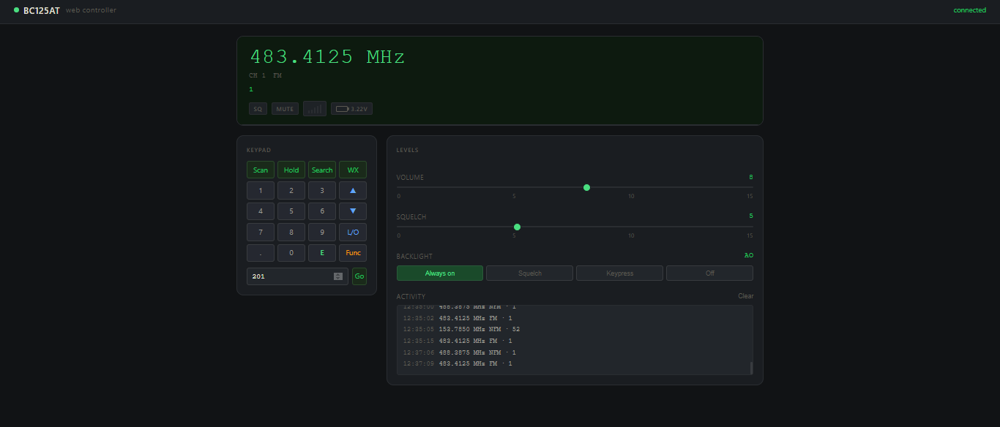

<div align="center">

```
██████╗  ██████╗ ██╗██████╗ ███████╗ ██████╗ █████╗ ███╗   ██╗
██╔══██╗██╔════╝███║╚════██╗██╔════╝██╔════╝██╔══██╗████╗  ██║
██████╔╝██║     ╚██║ █████╔╝███████╗██║     ███████║██╔██╗ ██║
██╔══██╗██║      ██║██╔═══╝ ╚════██║██║     ██╔══██║██║╚██╗██║
██████╔╝╚██████╗ ██║███████╗███████║╚██████╗██║  ██║██║ ╚████║
╚═════╝  ╚═════╝ ╚═╝╚══════╝╚══════╝ ╚═════╝╚═╝  ╚═╝╚═╝  ╚═══╝
```

### **Web Controller** — Uniden BC125AT / UBC125XLT

*A dark, real-time browser interface for your scanner. No proprietary software. No Windows required.*

---


</div>

---

## `> OVERVIEW`

**BC125AT Web Controller** is a modern, open-source web application that gives you full remote control of your Uniden Bearcat BC125AT or UBC125XLT scanner from any browser on your local network.

Built on a **Python + Flask** backend with a **real-time WebSocket** frontend, it replaces clunky manufacturer software with a sleek, dark radio-panel UI that feels purpose-built for the hardware.

> Control your scanner from your desktop, laptop, or second monitor — no phone app, no cloud, no subscription. Just open a browser.

---

## `> SCREENSHOT`

<div align="center">



*Live frequency display · Full keypad emulation · Volume & squelch control · Activity log*

</div>

---

## `> FEATURES`

```
◆  Real-time frequency display with channel name and modulation
◆  Full keypad emulation — every button on the scanner, in your browser
◆  Volume and squelch control via drag sliders
◆  Backlight mode switching (Always On / Off / Squelch / Keypress)
◆  Direct channel jump (1–500)
◆  Scan group management — enable or disable any of the 10 banks
◆  Priority mode control (Off / On / Plus / DND)
◆  Battery voltage monitoring
◆  Signal strength indicator
◆  Live activity log with timestamps
◆  REST API — every feature is accessible as a clean JSON endpoint
◆  WebSocket push updates (Phase 4) — zero-latency live display
◆  Modular architecture — built to expand
```

---

## `> TECH STACK`

| Layer | Technology |
|---|---|
| Backend | Python 3.10+ · Flask 3.1 · Flask-SocketIO |
| Serial comms | pySerial |
| Real-time | WebSockets via eventlet |
| Frontend | Vanilla HTML5 · CSS3 · JavaScript |
| Config | python-dotenv |
| Platform | Windows (COM port) · Linux (/dev/ttyACM0) |

---

## `> QUICK START`

### 1 — Prerequisites

- Python 3.10 or later
- Uniden BC125AT or UBC125XLT scanner
- USB programming cable

### 2 — Clone & install

```bash
git clone https://github.com/yourusername/bc125at-web-controller.git
cd bc125at-web-controller

python -m venv venv
venv\Scripts\activate          # Windows
# source venv/bin/activate     # Linux / macOS

pip install -r requirements.txt
```

### 3 — Configure

```bash
copy .env.example .env         # Windows
# cp .env.example .env         # Linux
```

Edit `.env` if your scanner is not on `COM3`:

```env
SCANNER_PORT=COM3
SCANNER_BAUD=115200
FLASK_PORT=5000
```

### 4 — Verify connection

```bash
python test_connection.py
```

Expected output:

```
----------------------------------------------------
  BC125AT Connection Test
  Port: COM3
----------------------------------------------------
[1/6] Opening serial port...   OK
[2/6] Requesting model (MDL)   OK — BC125AT
[3/6] Requesting firmware...   OK — Version 1.06.09
...
  Result: PASS — scanner is communicating correctly.
----------------------------------------------------
```

### 5 — Launch

```bash
python app.py
```

Then open **http://localhost:5000** in your browser.

---

## `> API REFERENCE`

All endpoints return a consistent JSON envelope:

```json
{ "success": true, "message": "OK", "data": { ... } }
```

| Method | Endpoint | Description |
|---|---|---|
| `GET` | `/api/health` | Server + scanner connection status |
| `GET` | `/api/status` | Full scanner state snapshot |
| `POST` | `/api/key/<key>` | Simulate a key press |
| `GET` | `/api/volume` | Get current volume (0–15) |
| `POST` | `/api/volume/<level>` | Set volume (0–15) |
| `GET` | `/api/squelch` | Get current squelch (0–15) |
| `POST` | `/api/squelch/<level>` | Set squelch (0–15) |
| `GET` | `/api/backlight` | Get backlight mode |
| `POST` | `/api/backlight/<mode>` | Set backlight (AO/AF/KY/SQ/KS) |
| `GET` | `/api/channel/<ch>` | Get channel info (1–500) |
| `POST` | `/api/channel/<ch>` | Jump to channel (1–500) |
| `GET` | `/api/groups` | Get scan group states |
| `POST` | `/api/groups` | Set scan group states |
| `GET` | `/api/priority` | Get priority mode |
| `POST` | `/api/priority/<mode>` | Set priority (0=Off/1=On/2=Plus/3=DND) |
| `POST` | `/api/scan` | Resume scanning |
| `POST` | `/api/hold` | Hold on current channel |
| `POST` | `/api/power/off` | Power off scanner |

### Valid key names

```
menu  func  scan  hold  search  weather  lockout  power
enter  up  down  left  right  0–9  dot  yes  no
```

---

## `> PROJECT STRUCTURE`

```
bc125-controller/
│
├── app.py                     ← Entry point · Flask + SocketIO init
├── config.py                  ← All configuration (env vars)
├── requirements.txt
├── .env.example
├── test_connection.py         ← Verify scanner comms before launching
│
├── scanner/                   ← Hardware package (fully self-contained)
│   ├── __init__.py            ← Clean public exports
│   ├── serial_manager.py      ← Low-level serial I/O
│   ├── commands.py            ← BC125AT command set + response parsers
│   └── scanner.py             ← High-level controller + polling thread
│
├── api/                       ← Web layer (decoupled from hardware)
│   ├── __init__.py
│   ├── routes.py              ← REST API endpoints
│   └── events.py              ← SocketIO event handlers (Phase 4)
│
├── templates/
│   ├── base.html              ← Site shell
│   └── index.html             ← Main dashboard
│
├── static/
│   ├── css/style.css          ← Dark radio panel theme
│   └── js/
│       ├── main.js            ← UI logic · polling · controls
│       └── socket.js          ← SocketIO client (Phase 4)
│
└── recordings/                ← Audio capture output (Phase 5)
```

---

## `> HARDWARE NOTES`

```
⚠  Volume and squelch are physical knobs on the BC125AT.
   They can be READ via serial but NOT set remotely.
   The API returns their current values but has no SET endpoint for these.

⚠  Backlight and channel commands require the scanner to enter
   program mode (PRG/EPG). This is handled automatically.

⚠  Frequencies are transmitted over serial in units of 100 Hz.
   483.4125 MHz → wire value 4834125 → displayed correctly by the UI.

⚠  The BC125AT supports channels 1–500 across 10 banks of 50.
```

---

## `> ROADMAP`

- [x] **Phase 1** — Serial communication layer
- [x] **Phase 2** — Flask REST API
- [x] **Phase 3** — Web dashboard (dark radio panel UI)
- [ ] **Phase 4** — Live WebSocket push updates
- [ ] **Phase 5** — Automatic audio recording on squelch open
- [ ] **Phase 6** — UI polish, settings page, channel manager

---

## `> PROTOCOL REFERENCE`

This project implements the **BC125AT PC Protocol V1.01** — the official Uniden serial command specification. A number of additional unofficial commands discovered by the community are also supported, including `STS`, `GLG`, `BAV`, `JNT`, and `POF`.

Official documentation: [BC125AT PC Protocol V1.01 (PDF)](https://info.uniden.com/twiki/pub/UnidenMan4/BC125AT/BC125AT_PC_Protocol_V1.01.pdf)

---

## `> CONTRIBUTING`

Pull requests are welcome. For major changes please open an issue first to discuss what you'd like to change.

1. Fork the repo
2. Create a feature branch (`git checkout -b feature/my-feature`)
3. Commit your changes (`git commit -m 'Add my feature'`)
4. Push to the branch (`git push origin feature/my-feature`)
5. Open a Pull Request

---

## `> LICENSE`

```
MIT License

Copyright (c) 2026

Permission is hereby granted, free of charge, to any person obtaining a copy
of this software and associated documentation files (the "Software"), to deal
in the Software without restriction, including without limitation the rights
to use, copy, modify, merge, publish, distribute, sublicense, and/or sell
copies of the Software, and to permit persons to whom the Software is
furnished to do so, subject to the following conditions:

The above copyright notice and this permission notice shall be included in all
copies or substantial portions of the Software.

THE SOFTWARE IS PROVIDED "AS IS", WITHOUT WARRANTY OF ANY KIND, EXPRESS OR
IMPLIED, INCLUDING BUT NOT LIMITED TO THE WARRANTIES OF MERCHANTABILITY,
FITNESS FOR A PARTICULAR PURPOSE AND NONINFRINGEMENT. IN NO EVENT SHALL THE
AUTHORS OR COPYRIGHT HOLDERS BE LIABLE FOR ANY CLAIM, DAMAGES OR OTHER
LIABILITY, WHETHER IN AN ACTION OF CONTRACT, TORT OR OTHERWISE, ARISING FROM,
OUT OF OR IN CONNECTION WITH THE SOFTWARE OR THE USE OR OTHER DEALINGS IN THE
SOFTWARE.
```

---

<div align="center">

*Built for radio enthusiasts who think the scanner deserved better software.*

**⭐ Star this repo if it's useful to you**

</div>
